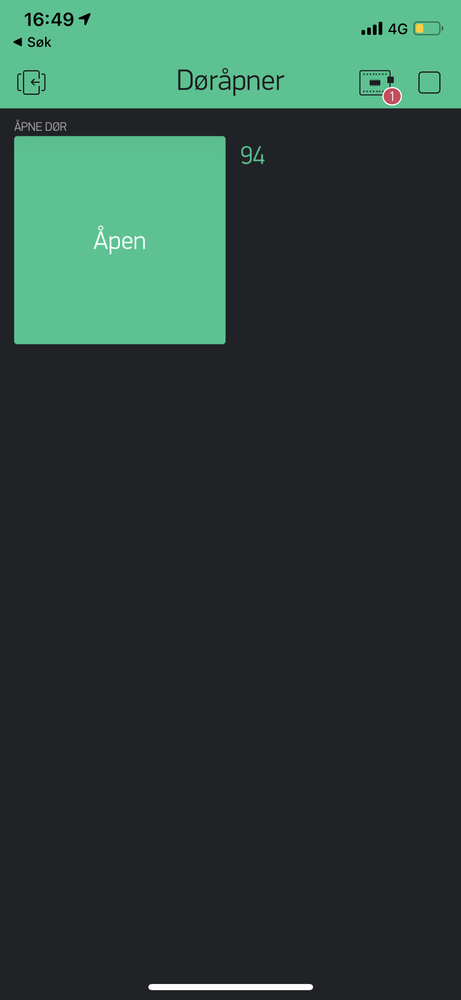
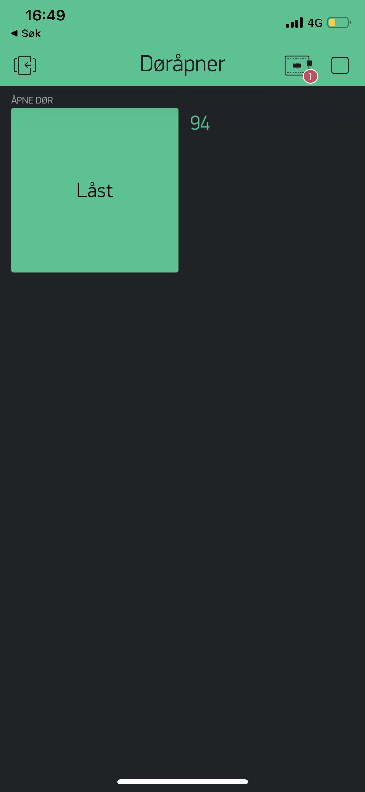

# DoorOpener

This is a home automation project with the aim to use my phone to let people in my apartment. As a proof of concept i use Blynk library running on an arduino which will enable a relay that activates the door opener in the apartment with a push of a button in the Blynk app.

 
